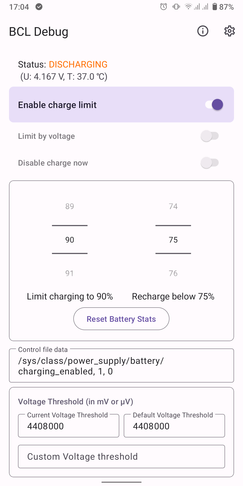
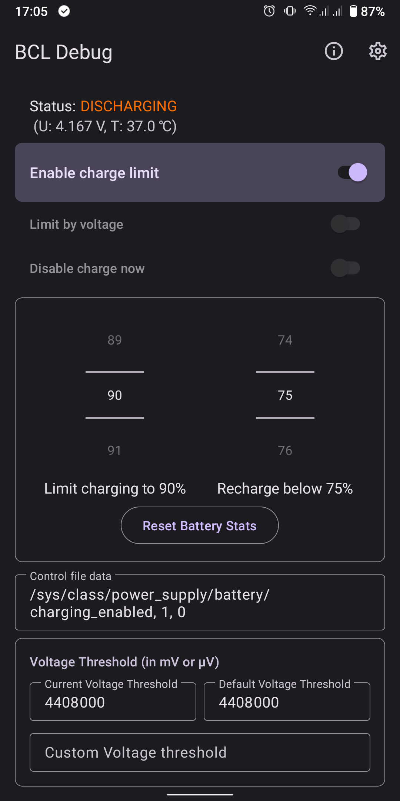
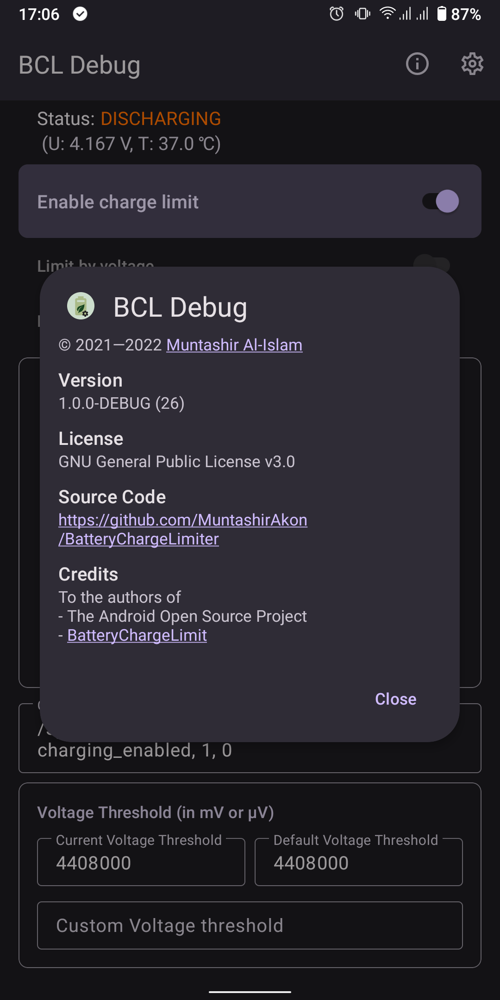

# Battery Charge Limiter (BCL) FORK

This fork specially designed for **NOTHING PHONE 2 (PONG)** using **Arter** Kernel

### Changes That I Made 
- Live Current Monitor on Homescreen.
- Passthrough mode
- Changed UI for easier use (personal taste)
- Added quick 500 and 1000 mA buttons on homescreen.
- Added reset CTRL file button.
- Set CTRL File default to /sys/class/qcom-battery/scenario_fcc
- Turkish translation completed.

### Notes
- You have to press buttons twice (idk) for them to take effect.
 - If they dont, unplug and plug the charger again.
- You should disable **Enforce Charge Limit**
- You dont have to change Control File Data.
- If you want to revert back, just uninstall the app and reboot device.

------------------------------------------------------------------------------------------------
------------------------------------------------------------------------------------
-------------------------------------------------------------------------------------
A fork of **Battery Charge Limit** whose development has been stalled for some time.

_This app is a work in progress. If a feature is not working, do not hesitate to file a report._

**NOTE:** This is app currently requires root to function. While it is not possible to control charging without root, an alarm-based solution might be implemented for no-root users in the future.

## Features
- Free and open source.
- Material 3 with dynamic colours.
- Control when to start and stop charging — either directly or via an widget.
- Set voltage threshold.
- Set custom battery control configuration if the supplied ones cannot be used properly.

### Same as ACC?
`acc` offers a broad range of features which might be too much for some people.

## Troubleshooting
If BCL cannot start or stop charging correctly, enable **Always Write CTRL File** in the settings.

## Screenshots

## License

GNU General Public License v3.0
